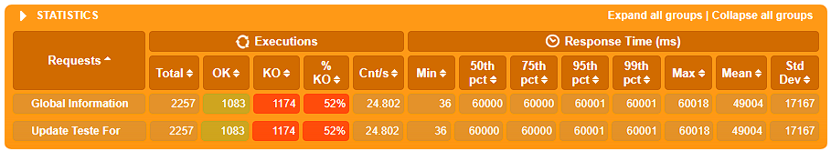
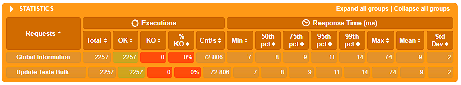

## MongoDB Update Strategies Performance Testing

This repository focuses on testing different update strategies in MongoDB, aiming to update multiple documents with distinct values for each one. The objective is to evaluate how various strategies perform in terms of time and resource consumption when applying updates to a large dataset.

The test is performed using Gatling, a powerful performance testing tool. The simulation updates a set of documents, each with unique values, and measures the efficiency and scalability of the update operations.

### Strategies

1. **/for - Update Logic in Loop**

2. **/bulk - BulkWrite Update**

3. **/filter - Update with Aggregate (ElementAt and Filter)**

4. **/hash - Update with Aggregate (getField)**

### Results






### Gatling Test Code
```
class SimulationUpdates extends Simulation {

  val httpProtocol8080 = http
    .baseUrl("http://localhost:3000")

  val userFeeder = csv("ids.csv").circular()

  val scn8080 = scenario("Update Teste")
      .repeat(250, "counter") {
        feed(userFeeder)
          .exec(session => {
            val currentId = session("ids").as[String]
            val userParam = ("users[]", currentId)
            val previousParams = session("userParams").asOption[Seq[(String, String)]].getOrElse(Seq())
            val newParams = previousParams :+ userParam
            session.set("userParams", newParams)
          })
      }
      .exec(
        http("Update Teste Hash")
          .put("/hash")
          .queryParamSeq("${userParams}")
          .check(status.is(200))
      )

  setUp(
    scn8080.inject(
      rampUsersPerSec(1).to(100).during(15.seconds),
      rampUsersPerSec(100).to(100).during(15.seconds)
    )
  ).protocols(httpProtocol8080)
}
```
