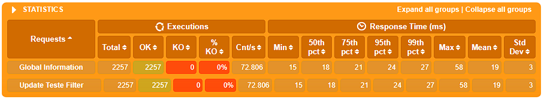

## MongoDB Update Strategies Performance Testing

This repository focuses on testing different update strategies in MongoDB, aiming to update multiple documents with distinct values for each one. The objective is to evaluate how various strategies perform in terms of time and resource consumption when applying updates to a large dataset.

The test is performed using Gatling, a powerful performance testing tool. The simulation updates a set of documents, each with unique values, and measures the efficiency and scalability of the update operations.

### Strategies

1. **/for - Update Logic in Loop**

2. **/bulk - BulkWrite Update**

3. **/filter - Update with Aggregate (ElementAt and Filter)**

4. **/hash - Update with Aggregate (getField)**

### Results:

As expected, using `update` inside a `for` loop proved disastrous, resulting in the worst performance. The best performance was observed with `bulkWrite` and `aggregate` with `hash`, which are very similar (within the margin of error). Lastly, using `aggregate` again, but with worse performance than the previous two approaches, as the filtering approach for each item is both costly and unnecessary.

- **Worst performance**: `update` inside a `for` loop.
- **Best performance**: `bulkWrite` and `aggregate` with `hash` (similar results, within margin of error).
- **Second best performance**: `aggregate` with filtering, which is slower due to the unnecessary overhead of filtering for each item.


### Test Results





### Gatling Test Code
```
class SimulationUpdates extends Simulation {

  val httpProtocol8080 = http
    .baseUrl("http://localhost:3000")

  val userFeeder = csv("ids.csv").circular()

  val scn8080 = scenario("Update Teste")
      .repeat(250, "counter") {
        feed(userFeeder)
          .exec(session => {
            val currentId = session("ids").as[String]
            val userParam = ("users[]", currentId)
            val previousParams = session("userParams").asOption[Seq[(String, String)]].getOrElse(Seq())
            val newParams = previousParams :+ userParam
            session.set("userParams", newParams)
          })
      }
      .exec(
        http("Update Teste Hash")
          .put("/hash")
          .queryParamSeq("${userParams}")
          .check(status.is(200))
      )

  setUp(
    scn8080.inject(
      rampUsersPerSec(1).to(100).during(15.seconds),
      rampUsersPerSec(100).to(100).during(15.seconds)
    )
  ).protocols(httpProtocol8080)
}
```
